# Developer's guide - Montserrat
>🔔 Hi! This is a guide in Spanish for my development team.
>
> In this guide you will find the conventions under which we work on this project.

## Metodología utilizada
### Conventional Commits

**Conventional commits** es un conjunto de normas mediante el cual vamos a crear nuestros commits. De esta forma lograremos que los mismos sean homogéneos y aporten la información necesaria.

> [!IMPORTANT]
> Para su implementación en VScode debemos instalar la extensión "Conventional Commits". Para ello simplemente debemos introducir su nombre en el buscador de extensiones y seleccionar la primer opción.

Para usar conventional commits debemos seguir los siguientes pasos:

1. Primero, vamos a hacer la siguiente combinación de teclas ```CTRL``` + ```SHIFT``` + ```P```.

    > [!NOTE]
    > La forma en que esta extensión afecta a lo que normalmente veníamos haciendo por consola solo incide en la creación de los commits. Los demás pasos como, agregar los archivos al commit mediante ```git add``` o actualizar el repositorio local con ```git pull``` o el remoto con ```git push``` se mantienen.

2. A continuación se nos abrirá un panel en el que debemos introducir el nombre de nuestra extensión "conventional commits" y seleccionar el primer resultado que nos muestre.

    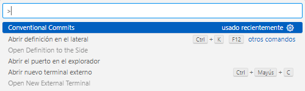

3. En caso de que estemos en una carpeta que contenga varios proyectos dentro, nos pedirá seleccionar el proyecto en el que estemos trabajando.

    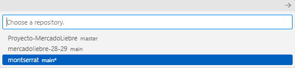

4. Una vez seleccionado nuestro proyecto, nos pedirá que indiquemos el tipo de cambio que realizamos. Estos cambios van desde los más complejos como modificaciones en el código, hasta los más simples como alterar la estructura de las carpetas.
    
    De igual forma, debajo de cada tipo de cambio encontraremos una breve descripción y debemos elegir aquella que mejor encaje con las modificaciones que hicimos.

    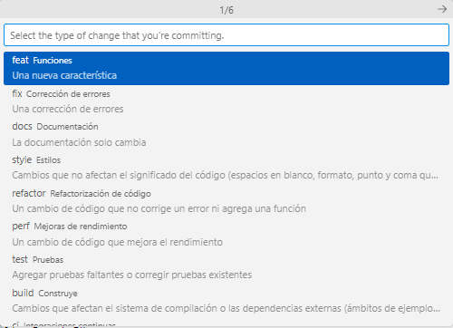

5. En el siguiente paso simplemente indicaremos la primer opción ```None```, debido a que, en nuestro caso, no será necesario su uso.

    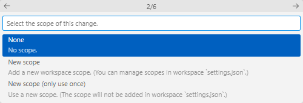

6. Seguido de esto, nos ofrecerá agregar una insignia o emoji, cuyo significado también está definido por una convención llamada [gitm😚ji](https://gitmoji.dev/). En nuestro caso, haremos uso de estos en todos los casos, ya que aportará a nuestros commits muchísima mayor claridad.

    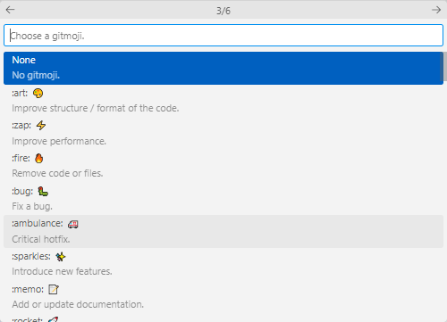

7. A continuación, nos pedirá que agreguemos una descripción corta sobre el cambio que hicimos, algo así como el título de nuestro commit. Vendría siendo lo que habitualmente colocábamos entre corchetes cuando realizábamos los commits por consola ```git commit -m " "```

    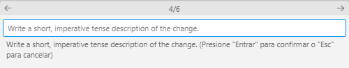

8. Luego de esto, nos ofrecerá agregarle a nuestro commit una descripción larga o cuerpo, en donde nos podremos explayar todo lo que queramos.

    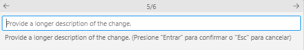

9. Por último, nos permitirá insertar un pie de pagina a la descripción de nuestro commit. En él podremos dar créditos a colaboraciones hechas por otros integrantes del grupo o también indicar si el cambio fue testeado y aprobado(opcional).

    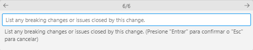


    Como resultado final, obtendremos commits como este, que nos permitirán ver con mayor claridad el proceso de desarrollo.

    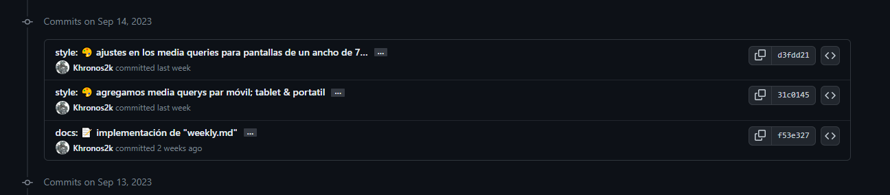

    Y los detalles adicionales que introdujimos se verán de esta fomra

    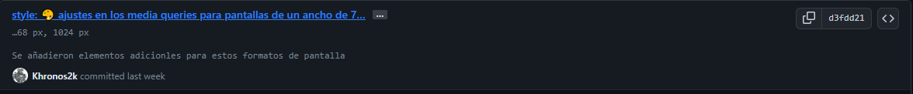


### Metodología B-E-M
BEM, cuyo significado es **B**lock **E**lement **M**omdifier, nos permitirá mantener una estructura ordenada para trabajar con nuestras clases en HTML.


Dicha estructura es la siguiente: 

```html
<div class="B__E--M"></div>
```

* Bloque/Block: aquellos elementos que poseen una identidad independiente con significado propio. Un bloque puede ser simple o compuesto.

> Restricciones de nombre de bloque: no mayus/No doble guiones consecutivos (--) /No doble guiones bajos consecutivos (__). Ejemplo: Error => header--navbar || Correcto => header-navbar.
> Nombres de bloques permitidos: aquellos que tengan nombres compuestos por dos o más palabras que representen su funcionalidad pueden llevar un guion en medio para separlas. Ejemplo:
> class="products-list"

Ejemplo de Bloques:

```html

<div class="header">
    ...
</div>

<div class="search-block">
    ...
</div>

<div class="custom-form">
    ...
</div>

<div class="another-block-custom">
    ...
</div>

```
* Elemento/Element: aquellos elementos que sean hijos de un bloque.

Ejemplo de Elementos:

```html
<div class="block">
    <div class="block__element">
        ...
    </div>
    <div class="block__element">
        ...
    </div>
</div>
```
* Modificador/Modifier: para elementos que tengan declaraciones de CSS diferentes al resto pero que compartan propiedades. Por ejemplo: puede tratarse de dos botones que comparten tamaño, font, padding, etc. Pero que necesites hacer que uno tenga su background de color rojo y otro de color verde.

```html
<div class="block">
    <div class="block__element">
        ...
    </div>
    <div class="block__element block__element--modifier">
        ...
    </div>
</div>
*/
```

## Branches

Las **Branchs** o **ramas** nos permite trabajar de forma más ordenada y que no estemos constantemente modificando la rama principal, es decir, nuestro main.

Para trabajar con ellas, debemos seguir los siguientes pasos:

> [!IMPORTANT]
> Antes de comenzar, procurá tener la última versión estable del proyecto introduciendo por consola el comando  ```git pull origin main```.

1. Primero, vamos a crear una nueva rama introduciendo por consola el comando ```git branch``` + ```name```. En el caso de que vayamos a añadir una nueva funcionalidad quedaría algo así ```git branch feature```

    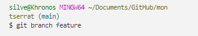

    > [!NOTE]
    > Antes de seguir adelante, podemos verificar que este paso se haya concretado correctamente.
    >
    > Para ello podemos utilizar el comando ```git branch```
    
    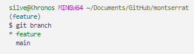
   
3. Lo siguiente que vamos a hacer es movernos de la rama principal ```main``` a nuestra nueva rama que, en este caso, denominamos ```feature```.

    Para ello vamos a utilizar el comando ```git checkout``` + ```name```, es decir ```git checkout feature```

    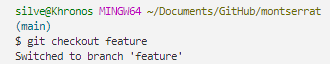

    > [!NOTE]
    > Antes de seguir adelante, podemos verificar que este paso se haya concretado correctamente.
    >
    > Para ello podemos utilizar, nuevamente, el comando ```git branch```
    >
    > Como podemos observa en la imagen, nos señalan nuestra ubicación con un aspecto diferente sobre el nombre de la ramma en la que estamos.

    Hasta este punto no observaremos nada diferente en nuestro código o carpetas del proyecto. Pero lo que acabamos de hacer es una copia local de todo el proyecto y, al estar ubicados en la nueva rama, cada cambio o agregado que hagamos estarán siendo sobre la copia.

    Así que ya tenemos un nuevo entorno sobre el cual trabajar como lo venimos haciendo habitualmente pero de forma paralela. Esto quiere decir que podemos seguir creando commits de los cambios que hagamos en esta nueva rama, lo cual es muy importante que se haga.

    **A continuación un ejemplo práctico:**

    Supongamos que la rama que creamos fue para insertar la página de error 404.

    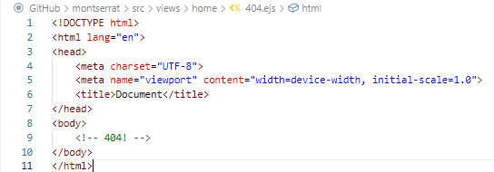

    Hecho este cambio, vamos a crear el commit con [conventional commit](#conventional-commits).

    > [!NOTE]
    > Algo curioso que pasa cuando trabajamos con una rama paralela al main, es que cuando volvemos a ubicarnos en la rama principal utilizando ```git checkout main``` y vamos a los achivos que modificamos en nuestra rama alterna, nos encontraremos con que los cambios que hicimos no se muestran en el proyecto. Como ejemplo el archivo 404.ejs que se muestra completo en la imagen anterior.
    
    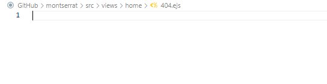

    Una vez hayas añadido tu primer commit de las modificaciones o agregados que hiciste al proyecto, aún si la funcionalidad como tal no está completada en su totalidad, puedes avanzar al siguiente paso.

4. Lo que debemos hacer ahora por una cuestión de seguridad, ya que nuestro progreso va a estar muchísimo más seguro en la nube es, subir a nuestro repositorio de GitHub nuestra nueva rama con sus respectivos commits. 

    Esto lo haremos utilizando el comando  ```git push origin``` + ```newNameBranch```, es decir ```git push origin feature```

    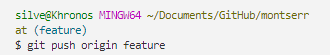

    Lo que obtendremos como resultado será lo siguiente:

    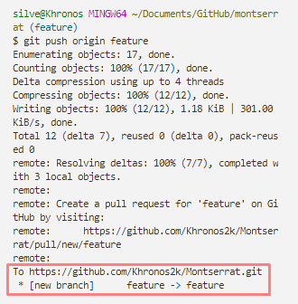

    Señalado con un cuadro rojo, veremos la confirmación de que se ha creado una rama en nuestro repositorio remoto y que el commit se subió con éxito.

    Y lo que obtendremos en nuesro repositorio en GitHub será lo siguiente.

    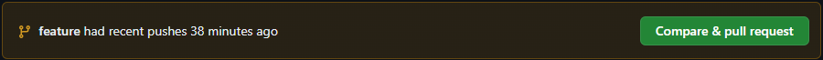

    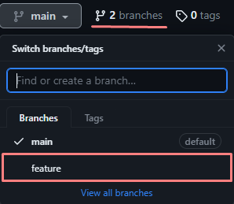

## Express

### Express-Validator

1. Primero debemos instalar ```express-validator```

    ```
    npm install express-validator
    ```

    > [!NOTE]
    > Antes de empezar con la validación, es importante tener en cuenta cómo están armados nuestros formularios. A la hora de escribir las validaciones, tomaremos como referencia la propiedad ```name``` de cada campo o input.

    ```html
    <form action ="/register" method="post">
        <label for="name">NOMBRE:</label>
        <input type="text" name="name" id="name">
        <label for="email">CORREO ELECTRONICO:</label>
        <input type="email" name="email" id="email">
        <label for="password">NOMBRE:</label>
        <input type="password" name="password" id="password">
        <button type="submit">Registrarse</button>
    </form>
    ```
2. Una vez tengamos el módilo instalado, vamos a requerirlo donde vayamos a realizar las validaciones. Podemos hacerlo directamente sobre el archivo de rutas o crear nuestras validaciones en un archivo aparte.

    En cualquiera de los casos, el primer paso será requerir el módulo y, haciendo uso de la desestructuración, pedir el método ```check```.

    ```js
    const {check} = require('express-validator');
    ```

    El segundo paso será crear una variable donde almacenaremos el conjunto de validaciones que realizaremos sobre el formulario.

    ```js
    let validateRegister = [];
    ```

    El método ```check()``` nos permite agregar validaciones para cualquiera de los campos del formulario. Como parámetro recibe el nombre del campo a validar. Si por ejemplo queremos validar el campo name, el método quedaría así:

    ```js
    const validateRegister = [ check('name') ];
    ```

    Suponiendo que quisiéramos validar que el campo no esté vacío, sobre el método anterior, ejecutamos el método ```notEmpty()``` de la siguiente manera:

    ```js
    const validateRegister = [
        check('name').notEmpty()
    ];
    ```
    
    >**Tipos de validaciones:**
    >```js
    >check('campo')
    >.notEmpty()    // Verifica que el campo no esté vacío
    >.isLength({min: 5, max: 10})   // Verifica la longitud de los datos
    >.isEmail()     // Verifica que sea un email válido
    >.isInt()       // Verifica que sea un número entero
    >```

    >[!NOTE]
    >Lista completa de validaciones:
    >[Validators ↗](https://github.com/validatorjs/validator.js#validators)

    >**Mensaje de error**
    >
    >Además de las validaciones, Express Validator nos permite definir el mensaje que recibirá el usuario por cada validación que falle.
    Para implementar los mensajes, utilizamos el método ```withMessage()``` a continuación de cada validación
    >```js
    >check('name')
    >   .notEmpty().withMessage('Debes completar el nombre')
    >   .isLength({ min: 5 }).withMessage('El nombre debe tener al menos 5 caracteres')
    >```

    >**Cortando la cadena de validación - bail()**
    >
    >En algunos casos vamos a querer cortar la validación, ya que si por ejemplo un campo está vacío, no tiene sentido verificar si es un e-mail válido.
    Si no cortamos la validación, el usuario recibirá todos los errores juntos en lugar de solo el que corresponda.
    Para esos casos, podemos implementar el método bail().
    >```js
    >check('email')
    >   .notEmpty().withMessage('Debes completar el email').bail()
    >   // En caso de que la primera validación falle,
    >   // las siguientes no se ejecutan para ese campo.
    >   .isEmail().withMessage('Debes completar un email válido')
    >```

    >**Ejemplo: array de validaciones completo**
    >```js
    >const validateRegister = [
    >   check('name')
    >       .notEmpty().withMessage('Debes completar el nombre').bail()
    >       .isLength({ min: 5 }).withMessage('El nombre debe ser más largo'),
    >   check('email')
    >       .notEmpty().withMessage('Debes completar el email').bail()
    >       .isEmail().withMessage('Debes completar un email válido'),
    >   check('password')
    >       .notEmpty().withMessage('Debes completar la contraseña').bail()
    >       .isLength({ min: 8 }).withMessage('La contraseña debe ser más larga')
    >]
    >```

3. El siguiente paso es agregar las validaciones en las rutas. Este middleware, se ubica entre la ruta y la acción del controlador.

    ```js
    const validateRegister = [ ... ];
    
    // Porcesamiento del formulario de creación
    router.post('/', validateRegister, userController.processRegister);
    ```
4. 