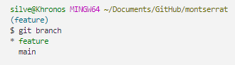

# Developer's guide - Montserrat
>🔔 Hi! This is a guide in Spanish for my development team.
>
> In this guide you will find the conventions under which we work on this project.

## Metodología utilizada
### Conventional Commits

**Conventional commits** es un conjunto de normas mediante el cual vamos a crear nuestros commits. De esta forma lograremos que los mismos sean homogéneos y aporten la información necesaria.

> [!IMPORTANT]
> Para su implementación en VScode debemos instalar la extensión "Conventional Commits". Para ello simplemente debemos introducir su nombre en el buscador de extensiones y seleccionar la primer opción.

Para usar conventional commits debemos seguir los siguientes pasos:

1. Primero, vamos a hacer la siguiente combinación de teclas ```CTRL``` + ```SHIFT``` + ```P```.

    > [!NOTE]
    > La forma en que esta extensión afecta a lo que normalmente veníamos haciendo por consola solo incide en la creación de los commits. Los demás pasos como, agregar los archivos al commit mediante ```git add``` o actualizar el repositorio local con ```git pull``` o el remoto con ```git push``` se mantienen.

2. A continuación se nos abrirá un panel en el que debemos introducir el nombre de nuestra extensión "conventional commits" y seleccionar el primer resultado que nos muestre.

    

3. En caso de que estemos en una carpeta que contenga varios proyectos dentro, nos pedirá seleccionar el proyecto en el que estemos trabajando.

    

4. Una vez seleccionado nuestro proyecto, nos pedirá que indiquemos el tipo de cambio que realizamos. Estos cambios van desde los más complejos como modificaciones en el código, hasta los más simples como alterar la estructura de las carpetas.
    
    De igual forma, debajo de cada tipo de cambio encontraremos una breve descripción y debemos elegir aquella que mejor encaje con las modificaciones que hicimos.

    

5. En el siguiente paso simplemente indicaremos la primer opción ```None```, debido a que, en nuestro caso, no será necesario su uso.

    

6. Seguido de esto, nos ofrecerá agregar una insignia o emoji, cuyo significado también está definido por una convención llamada [gitm😚ji](https://gitmoji.dev/). En nuestro caso, haremos uso de estos en todos los casos, ya que aportará a nuestros commits muchísima mayor claridad.

    

7. A continuación, nos pedirá que agreguemos una descripción corta sobre el cambio que hicimos, algo así como el título de nuestro commit. Vendría siendo lo que habitualmente colocábamos entre corchetes cuando realizábamos los commits por consola ```git commit -m " "```

    

8. Luego de esto, nos ofrecerá agregarle a nuestro commit una descripción larga o cuerpo, en donde nos podremos explayar todo lo que queramos.

    

9. Por último, nos permitirá insertar un pie de pagina a la descripción de nuestro commit. En él podremos dar créditos a colaboraciones hechas por otros integrantes del grupo o también indicar si el cambio fue testeado y aprobado(opcional).

    


    Como resultado final, obtendremos commits como este, que nos permitirán ver con mayor claridad el proceso de desarrollo.

    

    Y los detalles adicionales que introdujimos se verán de esta fomra

    


### Metodología B-E-M
BEM, cuyo significado es **B**lock **E**lement **M**omdifier, nos permitirá mantener una estructura ordenada para trabajar con nuestras clases en HTML.


Dicha estructura es la siguiente: 

```html
<div class="B__E--M"></div>
```

* Bloque/Block: aquellos elementos que poseen una identidad independiente con significado propio. Un bloque puede ser simple o compuesto.

> Restricciones de nombre de bloque: no mayus/No doble guiones consecutivos (--) /No doble guiones bajos consecutivos (__). Ejemplo: Error => header--navbar || Correcto => header-navbar.
> Nombres de bloques permitidos: aquellos que tengan nombres compuestos por dos o más palabras que representen su funcionalidad pueden llevar un guion en medio para separlas. Ejemplo:
> class="products-list"

Ejemplo de Bloques:

```html

<div class="header">
    ...
</div>

<div class="search-block">
    ...
</div>

<div class="custom-form">
    ...
</div>

<div class="another-block-custom">
    ...
</div>

```
* Elemento/Element: aquellos elementos que sean hijos de un bloque.

Ejemplo de Elementos:

```html
<div class="block">
    <div class="block__element">
        ...
    </div>
    <div class="block__element">
        ...
    </div>
</div>
```
* Modificador/Modifier: para elementos que tengan declaraciones de CSS diferentes al resto pero que compartan propiedades. Por ejemplo: puede tratarse de dos botones que comparten tamaño, font, padding, etc. Pero que necesites hacer que uno tenga su background de color rojo y otro de color verde.

```html
<div class="block">
    <div class="block__element">
        ...
    </div>
    <div class="block__element block__element--modifier">
        ...
    </div>
</div>
*/
```

## Branchs

Las **Branchs** o **ramas** nos permite trabajar de forma más ordenada y que no estemos constantemente modificando la rama principal, es decir, nuestro main.

Para trabajar con ellas, debemos seguir los siguientes pasos:

> [!IMPORTANT]
> Antes de comenzar, procurá tener la última versión estable del proyecto introduciendo por consola el comando  ```git pull origin main```.

1. Primero, vamos a crear una nueva rama introduciendo por consola el comando ```git branch``` + ```name```. En el caso de que vayamos a añadir una nueva funcionalidad quedaría algo así ```git branch feature```

    

    > [!NOTE]
    > Antes de seguir adelante, podemos verificar que este paso se haya concretado correctamente.
    >
    > Para ello podemos utilizar el comando ```git branch```
    >
    >

2. Lo siguiente que vamos a hacer es movernos de la rama principal ```main``` a nuestra nueva rama que, en este caso, denominamos ```feature```.

    Para ello vamos a utilizar el comando ```git checkout``` + ```name```, es decir ```git checkout feature```

    

    > [!NOTE]
    > Antes de seguir adelante, podemos verificar que este paso se haya concretado correctamente.
    >
    > Para ello podemos utilizar, nuevamente, el comando ```git branch```
    >
    >
    >
    > Como podemos observa en la imagen, nos señalan nuestra ubicación con un aspecto diferente sobre el nombre de la ramma en la que estamos.

    Hasta este punto no observaremos nada diferente en nuestro código o carpetas del proyecto. Pero lo que acabamos de hacer es una copia local de todo el proyecto y, al estar ubicados en la nueva rama, cada cambio o agregado que hagamos estarán siendo sobre la copia.

    Así que ya tenemos un nuevo entorno sobre el cual trabajar como lo venimos haciendo habitualmente pero de forma paralela. Esto quiere decir que podemos seguir creando commits de los cambios que hagamos en esta nueva rama, lo cual es muy importante que se haga.

    Una vez hayas añadido tu primer commit de las modificaciones o agregados que hiciste, aún si la funcionalidad como tal, no está completada en su totalidad, puedes avanzar al siguiente paso. 

3. Lo que debemos hacer ahora por una cuestión de seguridad, ya que nuestro progreso va a estar muchísimo más seguro en la nube es, subir a nuestro repositorio de GitHub nuestra nueva rama con sus respectivos commits. 

    Esto lo haremos utilizando el comando  ```git push origin``` + ```newNameBranch```, es decir ```git push origin feature```

     